# verilog-multipliers-with-synthesis-and-routing

An important block in “compute” unit is multipliers. Their performance impacts the
whole chip. This is why in this mini project, we will explore different implementations of
multipliers and study their characteristics.

In this repo, we implemented using verilog the following 32-bits signed integer multipliers:

**1- Verilog (‘*’) version of multiplier**

**2- Multiplier Tree (combinational)**

**3- Sequential Multiplier using shift & accumulate**

**4- Booth Algorithm**

**5- Radix-4 Booth Algorithm**

All multipliers will have an input register before the multiplier and an output register after the multiplier.

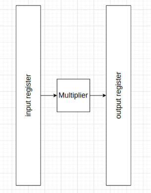

## Tree Multiplier

## Sequential Multiplier

## Booth Multiplier

[Booth Multiplier Explanation](https://www.geeksforgeeks.org/computer-organization-booths-algorithm/).

## Radix_4 Multiplier

[Radix-4 Multiplier Explanation](https://youtu.be/zu88Oq0zd0Y).

## Test cases in test bench file:

○ Multiplication of positive and negative number

○ Multiplication of positive and positive number

○ Multiplication of negative and negative number

○ Multiplication of negative and positive number

○ Multiplication by zero

○ Multiplication by 1

○ Additional 2 random test cases.

Your testbench should print **“TestCase#1: success”** on success and should
print the **“TestCase#1: failed with input X and Y and Output Z and overflow
status N”** , X,Y,Z snd N should be replaced by your values.

## Synthesis using Oasys:

**Synthesis the adders with the following constraints**

i. Set clock to 6ns.

ii. Set Input delay to 0.2ns.

iii. Set load to 10

iv. Set output load to 0.5ns.

v. Set Utilization to 60%

vi. Enable usage of all library cells.

## Place and route using Nitro:

**Place and route the adders with the following constraints**

i. Constraint clock skew to 0.2ns

ii. Only use vertical strips

## Files Locations:

**Code files for each design:** **_'multipliers_files_pre_synthesis'_** folder

**Code files for each testbench:** **_'test_benches' folder_**

**Code files for each design:** **_multipliers_files_pre_synthesis_**

**Synthesis, Placing and Rputing Results:** **_[multiplier_name]_multiplier_synthesis_and_routing_**

**DRC_Report_for_floating_multiplier:** **_DRC_Report_FLoat_Mult_** file

**LVC_Report_for_floating_multiplier:** **_LVS_Report_FLoat_Mult_** file

## Oasys Netlists

**Radix4Multiplier:**

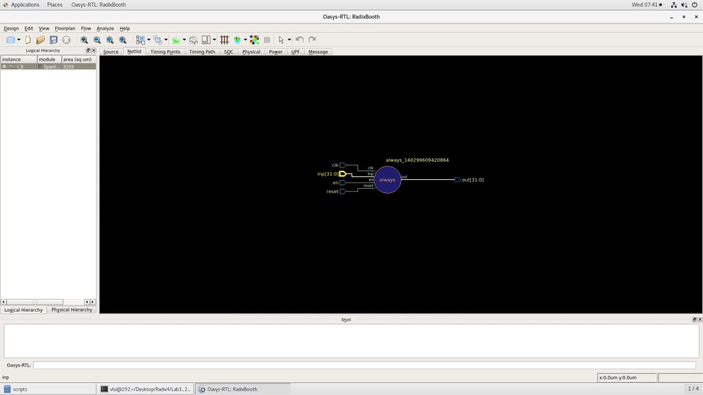
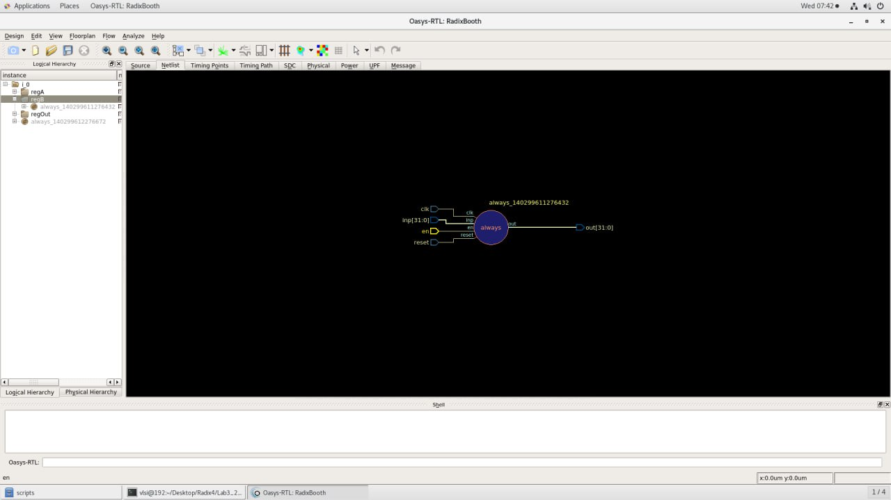
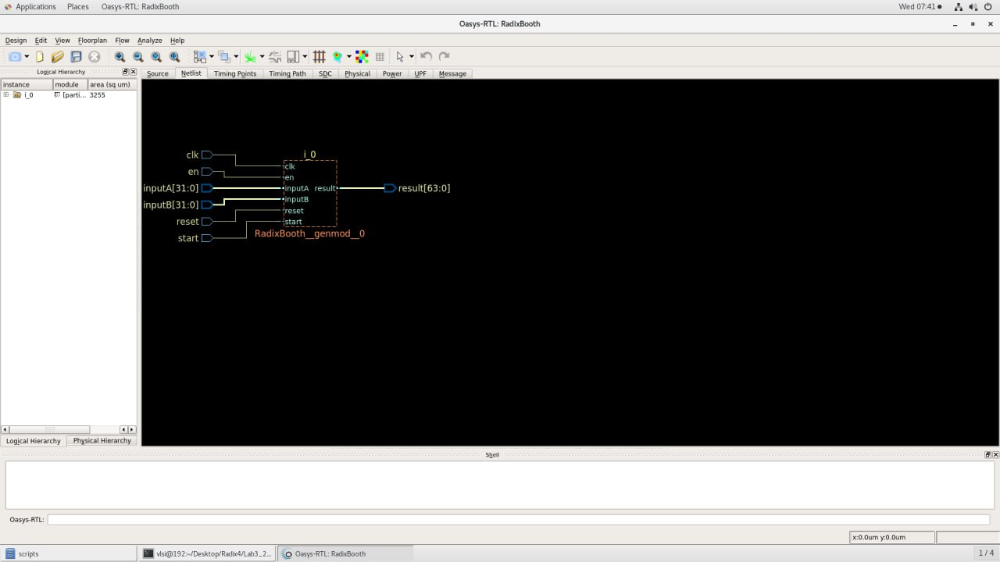
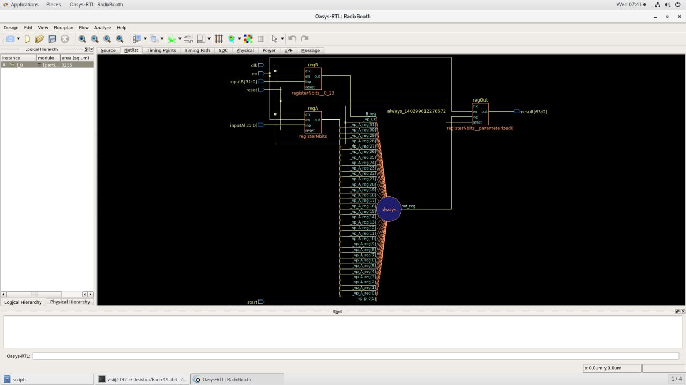
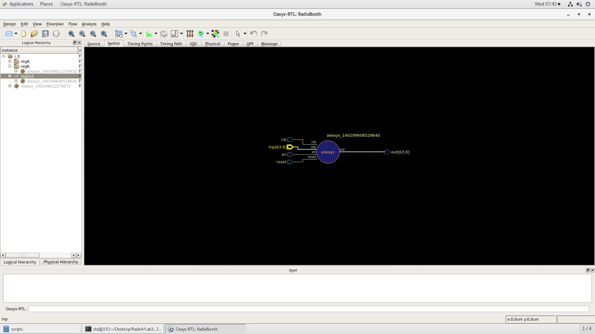

**Verilog_Multiplier:**

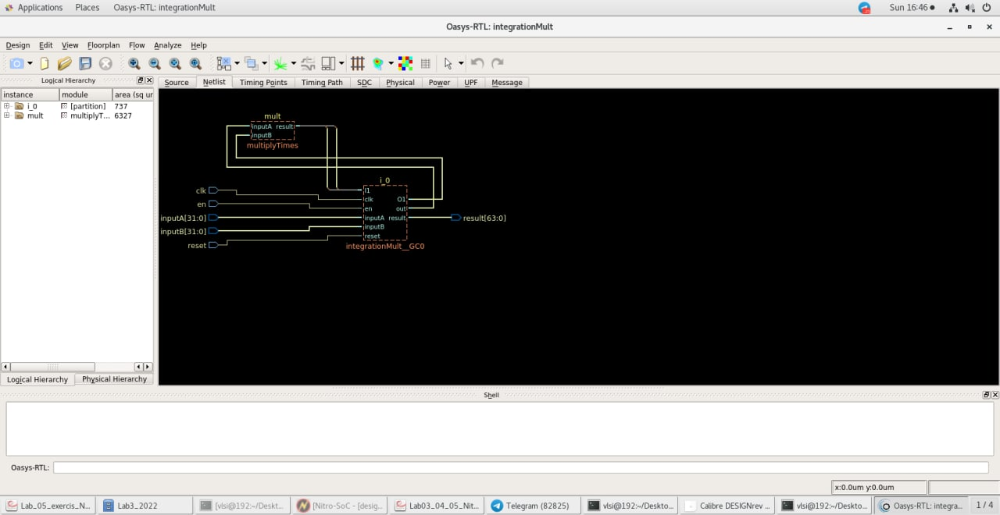
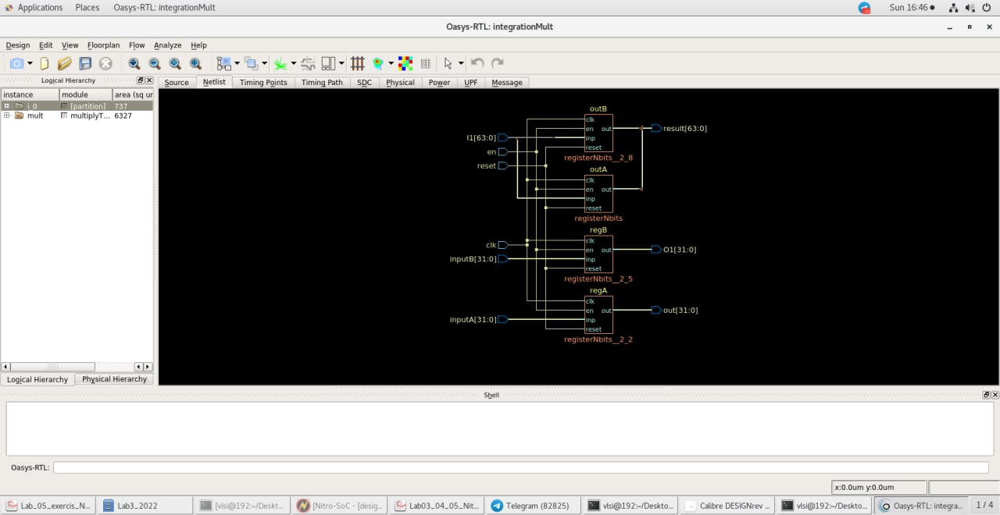
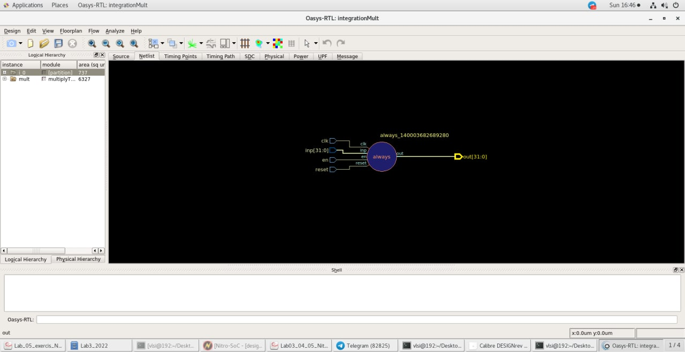
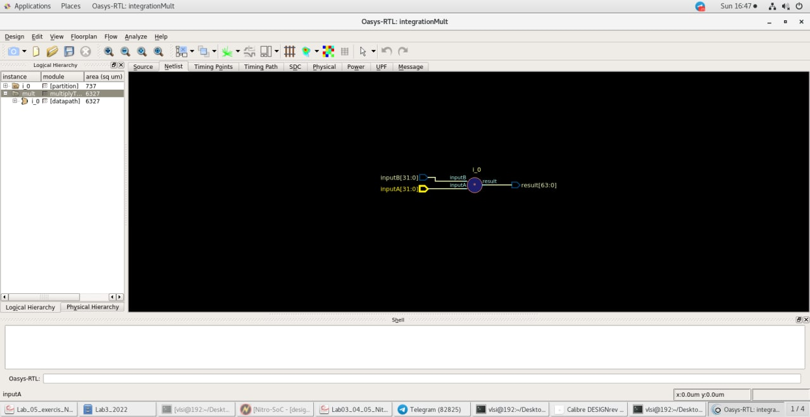

## Nitro final layout

**Radix4_Multiplier:**

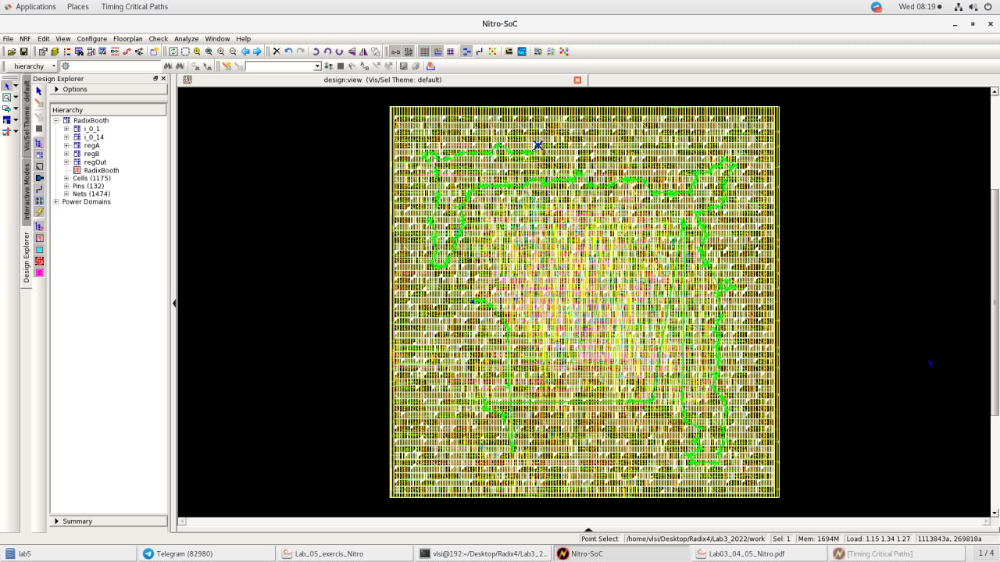

**Booth_Multiplier:**

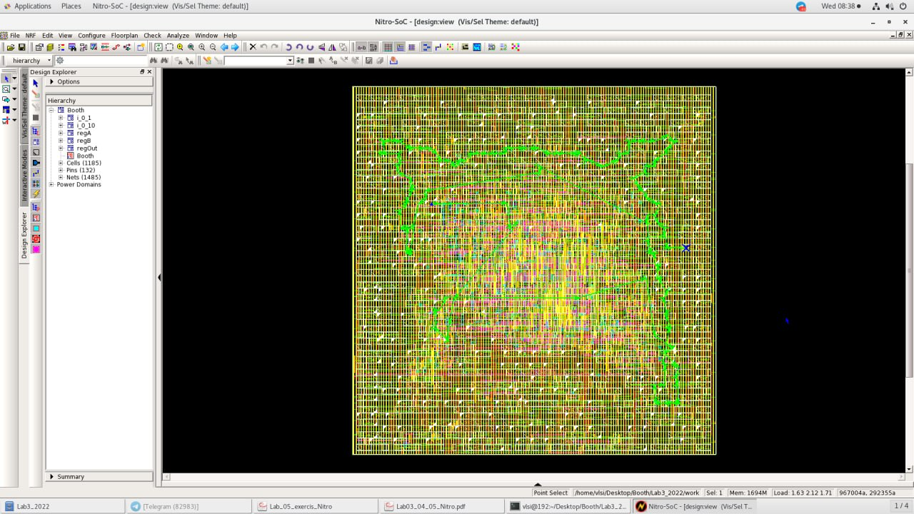

**Verilog_Multiplier:**

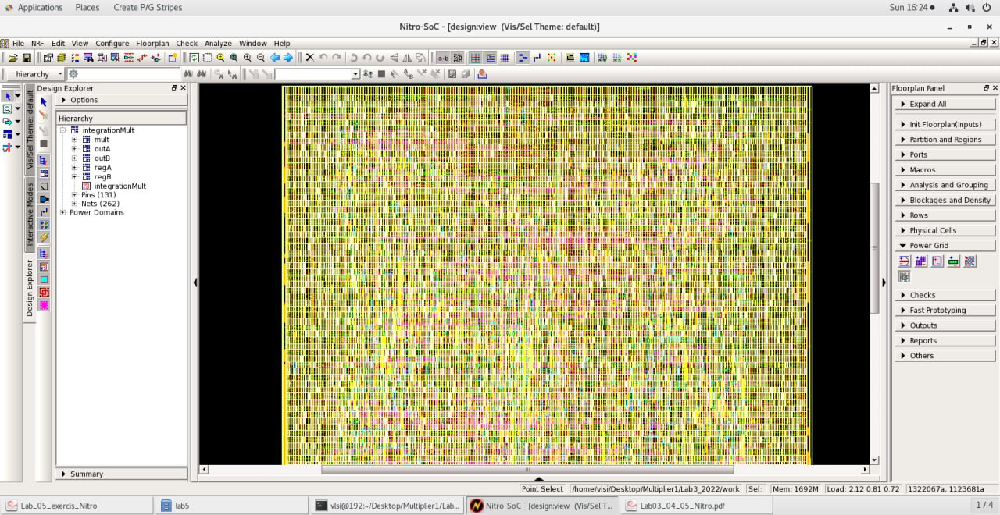

## Post_Synthesis_and_Routing_folders_content:

○ Do file to run and configure wave.

○ Constraints files

○ Scripts used for synthesis

○ Scripts used for Floorplanning, Placement & Routing

○ Oasys generated reports

○ Nitro generated reports

○ Post-synthesize code

○ Post-routing code

○ Sdf file

○ GDS

○ Final saved database from Nitro

## Post-Routing-Report

detailed reports are in post_synthesis_and_routing folders

**collective results report**:

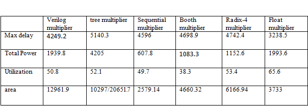

## Multiplier used in floating point multiplier

## How to test the modules?
1-Open Modelsim.

2-Create project

3-Add files in _helping_modules_ folder to the project

4-Add files in _multipliers_files_pre_synthesis_ folder to the project

5-Add files in test_benches folder

6-Simulate test bench files using modelsim

## DRC Report of floating point multiplier:

Results are in 'DRC_Report_FLoat_Mult' folder

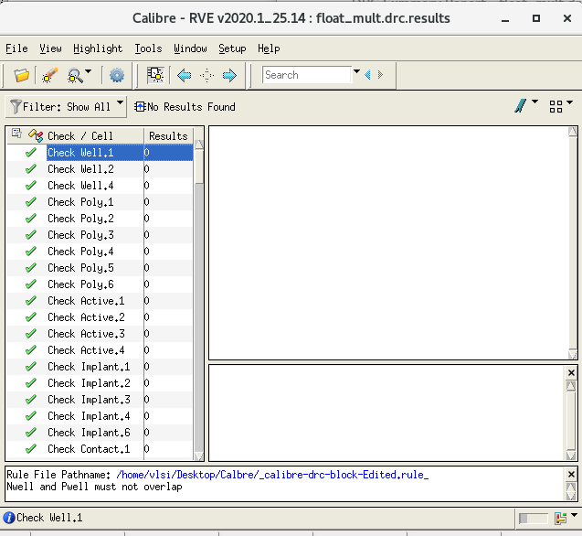

## LVC Report of floating point multiplier:

Results are in 'LVS_Report_FLoat_Mult' folder

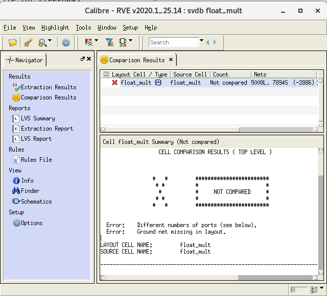
